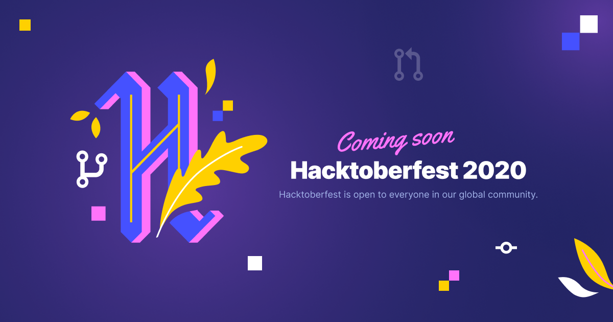

[](https://hack.letskhabar.com/)

[](https://app.netlify.com/sites/hacktober-fest/deploys)
[](https://github.com/letskhabar/HacktoberFest-2020/fork)
[](https://github.com/letskhabar/HacktoberFest-2020/stargazers)
[](https://github.com/letskhabar/HacktoberFest-2020/watchers)

# HacktoberFest-2020
Open source is changing the world - one pull request at a time.  Join our global community for the yearly celebration of open source software!


* Fork this repository (Click the Fork button in the top right of this page)
* Clone your fork to your local machine

```bash
git clone https://github.com/your-username/HacktoberFest-2020.git
```
* Open HacktoberFest-2020 Folder in your Favorite text editor
* Create a branch

```bash
git checkout -b branch-name
```

* Add your profile picture in `img` folder
* image should be square and name of image should be username.png/jpg/jpeg/gif
* add `["Your Name", "Image URL(./img/username.png)", "Bio", "Your Github Link"],` in `user.js`.
* Commit and push

```bash
git add .
git commit -m 'Commit message'
git push origin branch-name
```
* Create a new pull request from your forked repository (Click the ```New Pull Request``` button located at the top of your repository)
* Wait for your PR review and merge approval!

If you want the detailed guide on how to create a pull request then you may click [here](https://www.digitalocean.com/community/tutorials/how-to-create-a-pull-request-on-github) on how to create a pull request.

* Code Reviews
```bash
LGTM # Looks Good To Me 
CIAL # Code Is A Liability 
WIP # work in progress, do not merge yet
ACK # acknowledgement, i.e. agreed/accepted change
```

* And congratulations! You're all done. Have fun!
* You can resolve any open issues or add some exciting features to this repository!!!

## Happy Hacking

<a href="https://github.com/letskhabar/HacktoberFest-2020/graphs/contributors">
  
</a>

Made with [contributors-img](https://contributors-img.web.app).
